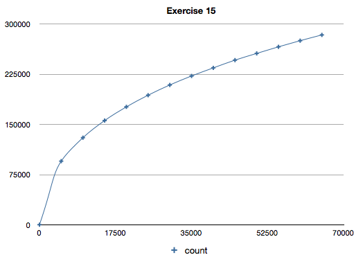

Exercise 15
===========

By using a MD5 reduction function `f`, outputting a key-size of 20 bits, we
have generated a Hallman's table with `2^16` chains, each with a length
of `2^8`. That is, by iterating the reduction function 256 times.

## Coverage

In total our implementation covers ca. **300000** of the total
ca. **1000000** (2^20), which gives us about **30 %** coverage.

## Count vs *i*

We have kept track of how many points of the total key-space we
actually have covered after *i* calls to the reduction function `f`:

<table>
    <tr>
        <td><b>Covered</b></td>
        <td><b><i>i</b></i></td>
    </tr>
    <tr>
        <td>0</td>
        <td>255</td>
    </tr>
    <tr>
        <td>5000</td>
        <td>95089</td>
    </tr>
    <tr>
        <td>10000</td>
        <td>130121</td>
    </tr>
    <tr>
        <td>15000</td>
        <td>155724</td>
    </tr>
    <tr>
        <td>20000</td>
        <td>176160</td>
    </tr>
    <tr>
        <td>25000</td>
        <td>193557</td>
    </tr>
    <tr>
        <td>30000</td>
        <td>208845</td>
    </tr>
    <tr>
        <td>35000</td>
        <td>222276</td>
    </tr>
    <tr>
        <td>40000</td>
        <td>234321</td>
    </tr>
    <tr>
        <td>45000</td>
        <td>245930</td>
    </tr>
    <tr>
        <td>50000</td>
        <td>255963</td>
    </tr>
    <tr>
        <td>55000</td>
        <td>265776</td>
    </tr>
    <tr>
        <td>60000</td>
        <td>274964</td>
    </tr>
    <tr>
        <td>65000</td>
        <td>283572</td>
    </tr>
</table>

These results can be found in `covered-points.csv`

Here is a graph showing the results:

    

